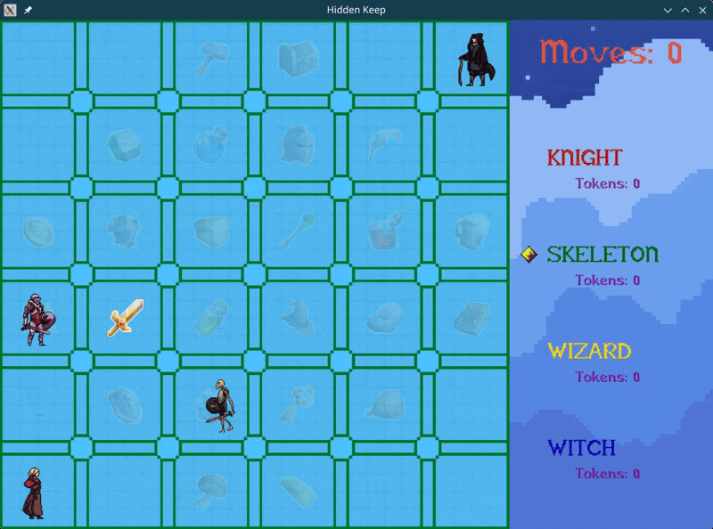

# Hidden Keep

A local multiplayer board game built in Rust with [macroquad](https://macroquad.rs/). <br>
Players place hidden walls, then race around the board collecting tokens. Hitting a hidden wall sends the player back to their starting space.



## Features

- 2 to 4 local players with animated sprites
- Mouse-based wall placement before the game starts
- BFS wall placement validation that prevents inaccessible board spaces
- Hidden board rotation after wall placement
- Configurable number of tokens needed to win
- Random token placement that avoids occupied player spaces
- Turn-based movement with randomized move counts
- Wall collision behavior that returns a player to their starting space
- Start, wall setup, gameplay, and endgame screens

## How To Run

Install Rust, then run the project with Cargo:

```bash
cargo run
```

## How To Play

1. Choose the number of players and tokens needed to win, then click `Start Game`.
2. Place walls with the mouse:
   - Left click places a wall.
   - Right click removes a wall.
   - Wall placements that block off part of the board are rejected.
   - Click `Set Walls` when finished.
3. The board is secretly rotated so the wall positions are hidden from all players.
4. Use the arrow keys to move the current player.
5. Land on a space with a token to collect it.
6. If a player hits a hidden wall, they return to their starting position.
7. The first player to collect the selected number of tokens wins.

## Project Structure

```
src/
├── main.rs           — application entry point, game loop, and top-level UI routing
├── game_state.rs     — game state machine and per-state update logic
├── game_data.rs      — shared data used across update, render, and menu code
├── wall_placement.rs — wall placement, BFS accessibility checks, and board rotation
├── render.rs         — all drawing functions for board, HUD, tokens, and players
├── assets.rs         — font, texture, and character asset loading
├── player.rs         — player movement, animation, fading, and collision helpers
├── token.rs          — token drawing, fading, and next-token selection
├── wall.rs           — wall model, orientation, drawing, and collision checks
├── colors.rs         — runtime color state and fade helpers for transitions
├── config.rs         — constants for board geometry, rendering, and gameplay
└── gui/              — macroquad UI menus and custom skin styling
```

## Built With

- [Rust](https://www.rust-lang.org/)
- [macroquad](https://macroquad.rs/)
- [rand](https://crates.io/crates/rand)
- [lerp](https://crates.io/crates/lerp)

## Asset Credits

Icons:

- https://cainos.itch.io/pixel-art-icon-pack-rpg
- https://kanomwan.itch.io/kw-16x16-gems-icon

Backgrounds:

- https://digitalmoons.itch.io/pixel-skies-demo
- https://cardinalzebra.itch.io/dungeon-tiles-1

Menu and buttons:

- https://franuka.itch.io/rpg-ui-pack-demo

Sprites:

- https://craftpix.net/freebies/free-knight-character-sprites-pixel-art/
- https://craftpix.net/freebies/free-wizard-sprite-sheets-pixel-art/
- https://craftpix.net/freebies/free-skeleton-pixel-art-sprite-sheets/

Font:

- https://fontstruct.com/fontstructions/show/2291821/montfaucon
